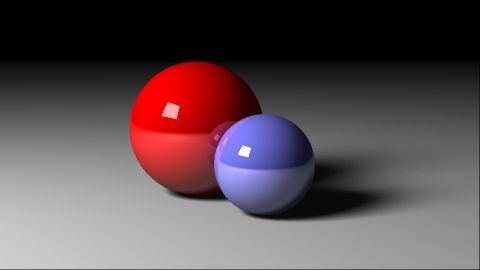

This repo works through the book "The Ray Tracer Challenge: A Test-Driven Guide to Your First 3D Renderer" by Jamis Buck

## Supported Features
1. Geometric primitives - Cube, Plane, Sphere, Cylinder, Cone, Triangles
2. Obj meshes
3. Point, Area lights
4. Phong shader supporting refraction/reflection
5. Bounding volume heirarchies
6. UV mapping - Planar, Cubic, Cylindrical, Spherical, uvs from obj files
7. Patterns - Checker, Gradient, Ring, Image file
8. Multi-Threading 
    - a. Dragon render 2000x800 single thread 44mins, 20 threads 5mins

## Sample Images

